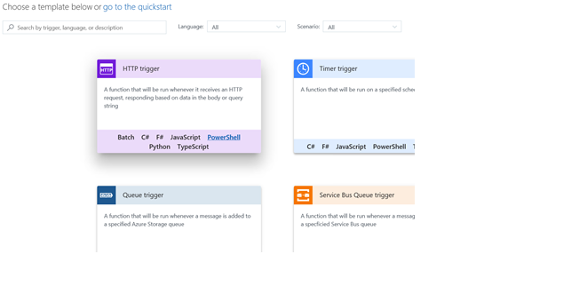
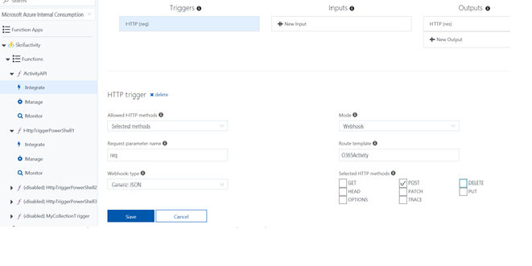
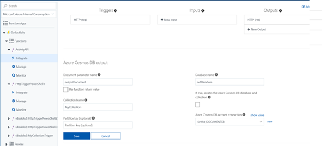
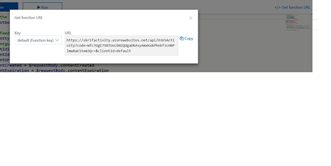
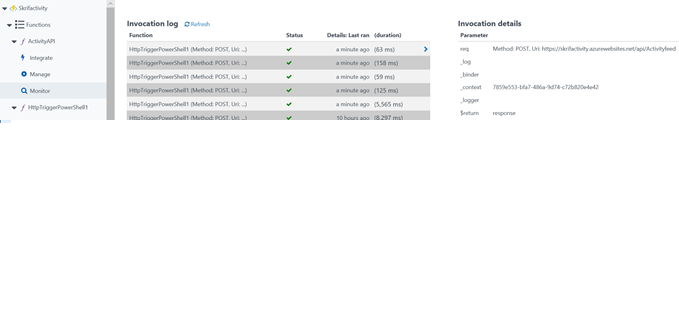

 # Office 365 activity feed sample

This sample can be used to process notifications from the Office 365 Activity API directly from an Azure Function. The sample will write the information to Azure Cosmos DB but with very small changes it can be used to write to Event Hubs, Blob Storage and other Azure components. The AzureADGraph is created to run as a scheduled function. It stores the state between the runs in a local file in the Azure function.
# Addition
The Investigation folder contains a sample that uses a Timer based function to import Office 365 Activity data to Cosmos DB. See separate blog post for more information. https://techcommunity.microsoft.com/t5/Security-Privacy-and-Compliance/Using-the-Office-365-Management-Activity-API-and-Power-BI-for/ba-p/189086

# Create and Register an App in Azure and delegate the appropriate permissions

Use this as a guide to create and register the application used for making requests. The “Configure an X.509 certificate to enable service-to-service calls” is not necessary for this test. It is enough to have the application and the appropriate permissions set. Do not forget the step to complete the Administrator consent.
https://msdn.microsoft.com/en-us/office-365/get-started-with-office-365-management-apis

# Steps to Create the Azure Function
1. Create your function app and name it appropriately. https://docs.microsoft.com/en-us/azure/azure-functions/functions-create-function-app-portalnew 
2. Select to create an Azure Function from within Azure Portal.
3. Create the HTTP trigger, select PowerShell since the sample is based on PowerShell. 
4. Authorization level is Function



5. Select to create the function

6. Use the code in ActivityFunctionApp.ps1 and modify the secrets to match your tenant and the Application created in previous step. From the Azure App you will need the Client ID, Client Secret, from your tenant you need the tenant name and GUID
7.Configure the integration of the trigger, below is the configuration I have been using to integrate the trigger. If you change the request parameter, you will have to change the corresponding lines in the code.



8. Configure the Output to COSMOS DB by either defining an existing DB or a new one. 



9. Get the App function key it will be used when you enable the Webhooks.


# Enable the subscriptions

Create a separate Azure Function to kick start the webhooks. This is not a common task it is mainly done when you need to make a change to the O365 Webhooks. You can just as well enable the webhooks from onpremises by running the script. See the enablesubscription.ps1 code for how to enable the Webhooks. You will have to make the same changes as for the Activity App.
When you have enabled the webhooks you will find entries in the invocation log from the WebHooks verifying that your app really is listening.



# Query the data using the SQL interface in Cosmos DB

You should see the COSMOS DB being populated with Records. You can use your own custom solution to query the data as needed. You can also download all the records to your own custom solution. https://docs.microsoft.com/en-us/azure/cosmos-db/

Here are a few sample queries to get you started.

If you want more information about a user
```sql
select * from investigate where investigate.UserId = "user@YOURDOMAIN" order by investigate.CreationTime
```
If you need more detail about a specific IP address
```sql
select * from investigate where investigate.ClientIP = "127.0.0.1" order by investigate.CreationTime
```
If you want to understand more about a specific file
```sql
select * from SPO where SPO.SourceFileName = "FILENAME.JPG" order by SPO.CreationTime
```

# Troubleshooting

To get more information about the environment and to troubleshoot issues use the Kudu interface. https://<myfunctionapp>.scm.azurewebsites.net/ 

https://docs.microsoft.com/en-us/azure/azure-functions/functions-how-to-use-azure-function-app-settings


# Contributing

This project welcomes contributions and suggestions.  Most contributions require you to agree to a
Contributor License Agreement (CLA) declaring that you have the right to, and actually do, grant us
the rights to use your contribution. For details, visit https://cla.microsoft.com.

When you submit a pull request, a CLA-bot will automatically determine whether you need to provide
a CLA and decorate the PR appropriately (e.g., label, comment). Simply follow the instructions
provided by the bot. You will only need to do this once across all repos using our CLA.

This project has adopted the [Microsoft Open Source Code of Conduct](https://opensource.microsoft.com/codeofconduct/).
For more information see the [Code of Conduct FAQ](https://opensource.microsoft.com/codeofconduct/faq/) or
contact [opencode@microsoft.com](mailto:opencode@microsoft.com) with any additional questions or comments.
