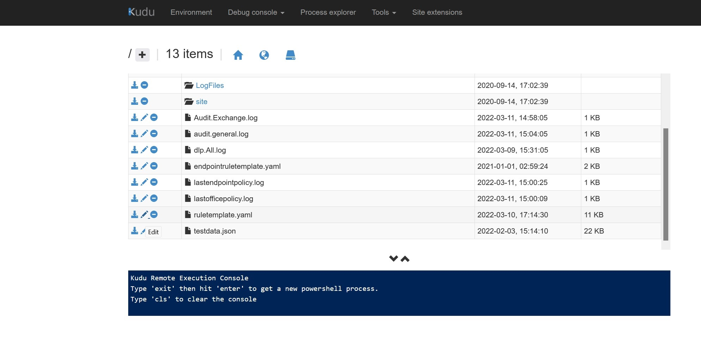

---
page_type: sample
products:
- office-365
- Sentinel
languages:
- powershellcore
extensions:
  - contentType: samples
  - createdDate: 09/21/2022 3:00:56 PM
---

The reason we haven’t pushed this to the core repo, the new code can break existing setups when running the enablement script. 

1.	Setup the service according to this blog post https://techcommunity.microsoft.com/t5/security-compliance-and-identity/advanced-incident-management-for-office-and-endpoint-dlp-using/ba-p/1811497, replace the endpointdlpservice.zip, with the dlpservice.zip in this repo, you can check the zip for any custom code. (This is step 9. in the blog post) The SHA256 hash is C54BE51AD9609685F8FCD0825453B7CADDFE329A2334CE71A66694B50CDA6FBF. (Check with PowerShell Get-FileHash)
2.	At the end of setting everything up, update the ruletemplate.yaml, and do not run the enablement function again since it will pull the templates from the repo. (The enablement function was meant to simplify but has become a bit of liability since it may brake older implementations)
a.	Replace the content in ruletemplate.yaml with ruletemplate.yaml in this repo.
b.	Replace the endpointruletemplate with endpointruletemplate.yaml.
When the files have been replaced, reset the date in lastofficepolicy.log and lastendpointpolicy.log to 2005-08-18T15:32:04.000Z and manually run the synchdlp functions. The updated templates make use of the most recent features in Sentinel and allows for dynamic importance and many other settings.

The best way to update is using Kudu   

In the file functions.zip, you can find a few sample functions that can be customized for your workflow requirements. They are merely a starting point.

•	ExportContent, exports evidence around the individual in the case from Office Activities etc…

•	NotifyManager, sends the approval email to line manager as an example and updates the Sentinel incident.

•	StartTeams, creates a Teams conversation in the channel designated in the app.

•	WeeklyDlp, sends a weekly digest to the managers about DLP events in their organization.

You run the import of the templates by using https://portal.azure.com/#create/Microsoft.Template, build your own template and load file.
