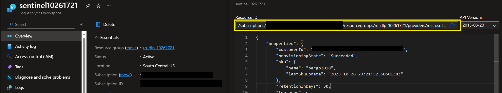
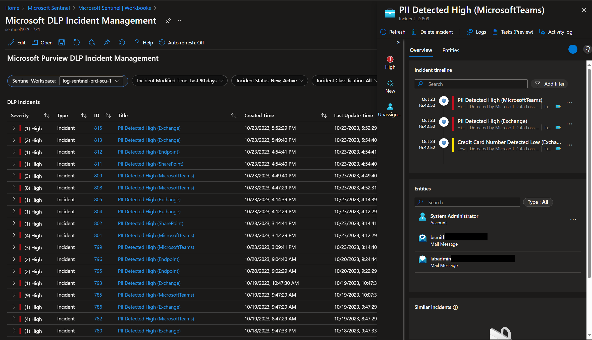
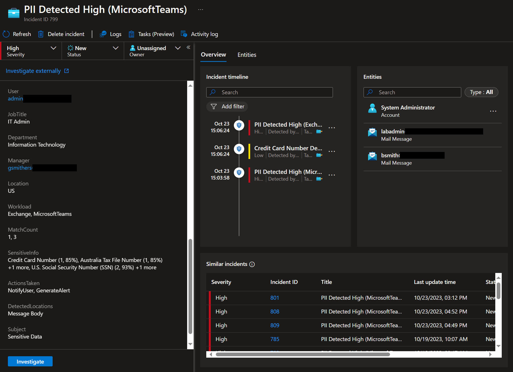

# Microsoft Purview DLP Sentinel Solution
This a fork of the initial [Sentinel DLP Solution](https://techcommunity.microsoft.com/t5/security-compliance-and-identity/advanced-incident-management-for-office-and-endpoint-dlp-using/ba-p/1811497). It has been updated for easy deployment, modernization of components, and to introduce new capabilities. Please review this document to understand the various components, considerations, and pre-requisites before deployment.

[](https://portal.azure.com/#create/Microsoft.Template/uri/https%3a%2f%2fraw.githubusercontent.com%2fOfficeDev%2fO365-ActivityFeed-AzureFunction%2fmaster%2fSentinel_Deployment%2fmain.json)

- [Release Notes](releaseNotes.md)
- [New Features](#new-features)
- [Solution Components](#solution-components)
- [Important Considerations](#important-considerations)
- [Getting Started](#getting-started)
- [Screenshots](#screenshots)
- [Updates](#updates)
- [Contributing](#contributing)

## New Features
- Fully packaged into a single ARM/Bicep deployment for easy installation and setup.
- Leverages new Data Collection Rule (DCR) custom tables to ingest and store DLP data. This provides fine grained security and unlocks new capabilities such as data transformations.
- Provides option to hash, remove, or retain the detected sensitive information values.
- Includes "PurviewDLP" Azure Monitor Function to normalize the DLP event data across all of the different workload types (Endpoint, Teams/Exchange, and SharePoint/OneDrive).
- Separates DLP data into the below three separate tables to allow for all sensitive information data to be ingested (some events would exceed the max field size when trying to store everything in a single row). This also allows for more flexible queries and restricting access to the sensitive information data if desired.
    - PurviewDLP: Core DLP event information, including violating user, impacted files/messages, etc.
    - PurviewDLPSIT: Contains the sensitive information types that were detected.
    - PurviewDLPDetections: Contains the sensitive information type detected values (evidence).
- For Endpoint DLP events, the severity of the alert/event is not currently included in the API, so by default the severity is derived from DLP policy rule name. The rule name must have a "Low", "Medium", or "High" suffix value with a space as the delimiter. For example, "DLP rule name Medium" or "DLP rule name High".
- Includes 3 built-in Sentinel workbooks to provide advanced incident management and reporting:
    - Microsoft DLP Incident Management
    - Microsoft DLP Activity
    - Microsoft DLP Organizational Context
- Includes two options for automatically deploying the built-in Sentinel analytics rules:
    - A single rule to create alerts and incidents across all DLP workload types. This will work for most environments where the 150 events per 5 min. limit is not being exceeded.
    - A rule for each Purview DLP policy and workload (DLP Policy Sync). This is to be used in scenarios where the 150 events per 5 min. limit is being exceeded or where more customization is desired based on workload.
- The syncing of the sensitivity label information and analytics rules now uses modern authentication mechanisms.
- Better error handling has been introduced to the code along with a more hardened configuration for the Azure components. For example, secrets are now stored in a Key Vault with restricted access from the Function App and private network access is enabled by default.

## Solution Components
- **Function App** with all of the dependencies (i.e., Storage Account, Key Vault, Application Insights, User-Assigned Managed Identity, etc.) and PowerShell code necessary to ingest the DLP events and sync sensitivity label information, and advanced Sentinel analytics rules (if desired). The Function App gets deployed using the Premium P0v3 SKU, unless Private Networking is not enabled, in which the Consumption SKU is used. This may need to be modified based on the load and security requirements. See [Azure Functions hosting options](https://learn.microsoft.com/en-us/azure/azure-functions/functions-scale) for more info. The following Functions get deployed:
    - **QueueDLPEvents**: Polls the Office 365 Activity API every minute to see if there are new DLP events. If so, it sends the content URI to a storage account queue to then get processed by the StoreDLPEvents Function.
    - **StoreDLPEvents**: Listens on an Azure storage account queue for new DLP event content URIs. When a new message arrives, it retrieves the content from Office 365 Management API, processes, enriches, and sends that data to Azure Monitor.
    - **SyncSensitivityLabels**: (Optional) Polls the Graph API every hour to get current list of Sensitivity Labels. It then syncs the data with the Sentinel "SensitivityLabels" watchlist. This is used as a lookup to enrich events at query time.
    - **SyncDLPAnalyticsRules**: (Optional) Polls the Azure Resource Manager API every hour to create a new Sentinel scheduled query rule for each DLP policy and workload. This is required when the 150 event per 5 min. limit is being reached and/or for more advanced customization based on policy/workload.
    - The Functions are written in PowerShell with the following dependencies. These dependencies are [managed by the Function App](https://learn.microsoft.com/en-us/azure/azure-functions/functions-reference-powershell?tabs=portal#dependency-management).
        - Azure PowerShell modules:
            - Az.Accounts
            - Az.Storage
            - Az.OperationalInsights
            - Az.Resources
        - Because we don't have a native PowerShell module yet to send data to Azure Monitor DCR tables, a custom PowerShell module (AzMon.Ingestion) leveraging the following .Net packages is used to authenticate and send data to the Azure Monitor/Sentinel workspace in a reliable and optimized way. **These are not automatically updated**.
            - [Azure.Monitor.Ingestion](https://www.nuget.org/packages/Azure.Monitor.Ingestion)
            - [Azure.Identity](https://www.nuget.org/packages/Azure.Identity)
- **Azure Monitor Custom Tables** to house the core DLP events along with the sensitive information data.
- **Azure Monitor Function** to parse and normalize the DLP event data across all of the different workload types (Endpoint, Teams/Exchange, and SharePoint/OneDrive). By default, a maximum of 30 sensitive info types and 5 detections per, will be returned. These values can be modified via the _DetectionsMax and _SITMax variables in the PurviewDLP function.
- **Azure Monitor Data Collection Rule** and **Data Collection Endpoint** required to ingest the DLP events via the new Azure Monitor Logs Ingestion API.
- **Sentinel Analytics Rule(s)** to automatically start turning the raw DLP events into actionable alerts and incidents within Sentinel. The appropriate entity mapping is also pre-configured.
- **Sentinel Workbooks** to help with advanced DLP incident management and reporting.
- **Sentinel Watchlists** to house sensitivity label information and to help with the analytics rule "DLP Policy Sync" feature if enabled.
- **Custom Role** to provide access to query Sentinel Watchlists and alert rules. Also provides limited permissions to read workspace details and run a query in the workspace, but not to read data from any tables. Direct "Reader" role assignments are added to the PurviewDLP_CL and Watchlist tables to provide read access to the data within.
- **Private Networking**, if enabled, restricts public access to the Function App for additional security. A Virtual Network, along with an NSG, Private Endpoints, and Private DNS Zones will be deployed to support this configuration. Although outbound traffic will be routed through the virtual network and NSG, no outbound restrictions are configured by this template. It is recommended to peer with a hub firewall to restrict outbound/internet access. Please see [Important Considerations](#important-considerations) for required firewall exclusion details.

## Important Considerations
> [!IMPORTANT]  
> Crucial information necessary for users to succeed.
- **This is an advanced custom solution and is intended to be used as a base template to allow for easy testing and piloting of the solution. It requires proper Azure and DevOps expertise to modify, maintain, and harden as needed to meet functional, operational, and security requirements. This solution is potentially processing and storing sensitive data so proper organizational security controls need to be implemented. When running any workload in Azure, be sure to follow the recommended practices (Security, Operations, Reliability etc.) as outlined in the [Azure Well-Architected Framework](https://learn.microsoft.com/en-us/azure/well-architected/). Also, be mindful of the sensitive data that may be ingested into Sentinel and who/what may have access. A dedicated workspace is recommended to allow for proper segmentation. See [Azure Monitor](https://learn.microsoft.com/en-us/security/benchmark/azure/baselines/azure-monitor-security-baseline) and [Sentinel](https://learn.microsoft.com/en-us/security/benchmark/azure/baselines/microsoft-sentinel-security-baseline) security baselines for further guidance on how to secure this resource.**
- The following artifacts get deployed to the Sentinel/Log Analytics workspace. If artifacts of the same type and name/id already exist, they will be potentially **overwritten**:
    - Log Analytics function named "PurviewDLP"
    - Watchlists named "Policy" and "SensitivityLabels"
    - Custom Tables named "PurviewDLP", "PurviewDLPSIT", and "PurviewDLPDetections".
    - Workbooks named "Microsoft DLP Incident Management", "Microsoft DLP Activity", and "Microsoft DLP Organizational Context"
- No outbound network access restrictions are a part of the template. Please refer to [Securing Azure Functions](https://learn.microsoft.com/en-us/azure/azure-functions/security-concepts?tabs=v4) for more information on how to further harden and secure the configuration. It is recommended to use the Private Networking option and peer the deployed Virtual Network with a hub firewall to restrict outbound/internet access. The following external HTTPS (Port 443) destinations are required to be added as exceptions:
    - login.microsoftonline.com
	- manage.office.com
	- graph.microsoft.com
	- management.azure.com
    - api.loganalytics.io
    - www.powershellgallery.com (PowerShell Gallery)
    - onegetcdn.azureedge.net (PowerShell Gallery)
    - psg-prod-centralus.azureedge.net (PowerShell Gallery)
    - psg-prod-eastus.azureedge.net (PowerShell Gallery)
    - az818661.vo.msecnd.net (PowerShell Gallery)
	- *FunctionAppName*.azurewebsites.net
	- *FunctionAppName*.scm.azurewebsites.net
	- *StorageAccountName*.blob.core.windows.net
	- *StorageAccountName*.queue.core.windows.net
	- Data Collection Endpoint URI (e.g., *dcename*-nwyp.southcentralus-1.ingest.monitor.azure.com)
    - [Application Insights](https://learn.microsoft.com/en-us/azure/azure-monitor/app/ip-addresses#outgoing-ports)

## Getting Started
### Prerequisites
- Sentinel/Log Analytics workspace Azure RESOURCE ID (Not the WORKSPACE ID) that the solution will ingest data into and provision the associated Sentinel artifacts (i.e., analytics rules, workbooks, function, etc.). This can be found by clicking the "JSON View" link within the Overview page of the Log Analytics workspace resource:

- Global Admin permissions on the Purview DLP Entra ID tenant to create the App Registration and grant Admin Consent as outlined in step #2 below.
- Owner permissions on an Azure Resource Group to deploy the solution to in step #3. If Owner permissions are not granted on the subscription, the *Microsoft.ContainerInstance* resource provider must be [registered on the subscription](https://learn.microsoft.com/en-us/azure/azure-resource-manager/management/resource-providers-and-types#azure-portal) before deployment in order for the code to be automatically deployed to the Function App. If the Sentinel workspace is in a different resource group than where the solution will be deployed, Owner permissions are also required on the Resource Group in order to deploy the custom role.

### Deployment
Review [Important Considerations](#important-considerations) before deploying.
1. Enable the **Microsoft 365 (formerly, Office 365) Sentinel Connector** and ensure the **OfficeActivity** table is provisioned if you would like further enrichment for SharePoint DLP events.
2. Create an **App Registration** with the following **Application** permissions and **grant Admin Consent**. Create a **secret** and copy the value along with the **Application (client) ID** and **Tenant ID** which will be used as parameter values in the below Azure deployment. This secret will be stored in the Key Vault. Remember that it will need to be rotated before the expiration date set during creation.
    - **Microsoft Graph**
        - Group.Read.All
        - User.Read.All
        - InformationProtectionPolicy.Read.All
    - **Office 365 Management APIs**
        - ActivityFeed.ReadDlp
3. Click the **Deploy to Azure** button at the top of this page and fill in the required parameters. Hover over the information icon for each parameter to get more details on what to enter. 
4. Click **Review + Create** to start the deployment. The deployment also activates the Office 365 Management API DLP.ALL subscription for the tenant if not already enabled. After a successful deployment, you should be able to see data in the Azure Monitor tables along with alerts and incidents being created in Sentinel once new DLP events are generated.

## Screenshots
### Incident Management Workbook


### Sentinel Incident View


## Updates
View the [Release Notes](releaseNotes.md) to see version details. You can also subscribe to/watch the repo for new pull requests to get notified when updates occur. 

Before proceeding, if your Function App was configured for Private Network Access, you will need to make sure you are accessing from a device that has connectivity to its private endpoint or that a valid exclusion for your client's public IP address has been added. See [Set up Azure App Service access restrictions](https://learn.microsoft.com/en-us/azure/app-service/app-service-ip-restrictions?tabs=azurecli) for more information.

To check the current running version, perform the following:
1. In the Azure Portal, navigate to the Function App and select **Advanced Tools**, then select **Go**. This will bring you to the Kudu portal.
2. In the Kudu portal, select **PowerShell** from the **Debug Console** menu at the top.
3. In the **Kudu Remote Execution Console**, type: **cat .\site\wwwroot\version.info**. The current version should be displayed.

To update the Function App with the latest version of the code, you can use the following Azure PowerShell commands:
```Powershell
#Download latest Function App package.
Invoke-WebRequest -Uri "https://raw.githubusercontent.com/OfficeDev/O365-ActivityFeed-AzureFunction/master/Sentinel_Deployment/functionPackage.zip" -OutFile "functionPackage.zip"

#Select the subscription that contains the Function App to be updated.
Set-AzContext -Subscription '[Subscription name]'

#Update Function App with the new package.
Publish-AzWebapp -ResourceGroupName "[Resource group name]" -Name "[Function App name]" -ArchivePath functionPackage.zip -Force
```

## Contributing

This project welcomes contributions and suggestions.  Most contributions require you to agree to a
Contributor License Agreement (CLA) declaring that you have the right to, and actually do, grant us
the rights to use your contribution. For details, visit https://cla.microsoft.com.

When you submit a pull request, a CLA-bot will automatically determine whether you need to provide
a CLA and decorate the PR appropriately (e.g., label, comment). Simply follow the instructions
provided by the bot. You will only need to do this once across all repos using our CLA.

This project has adopted the [Microsoft Open Source Code of Conduct](https://opensource.microsoft.com/codeofconduct/).
For more information see the [Code of Conduct FAQ](https://opensource.microsoft.com/codeofconduct/faq/) or
contact [opencode@microsoft.com](mailto:opencode@microsoft.com) with any additional questions or comments.
